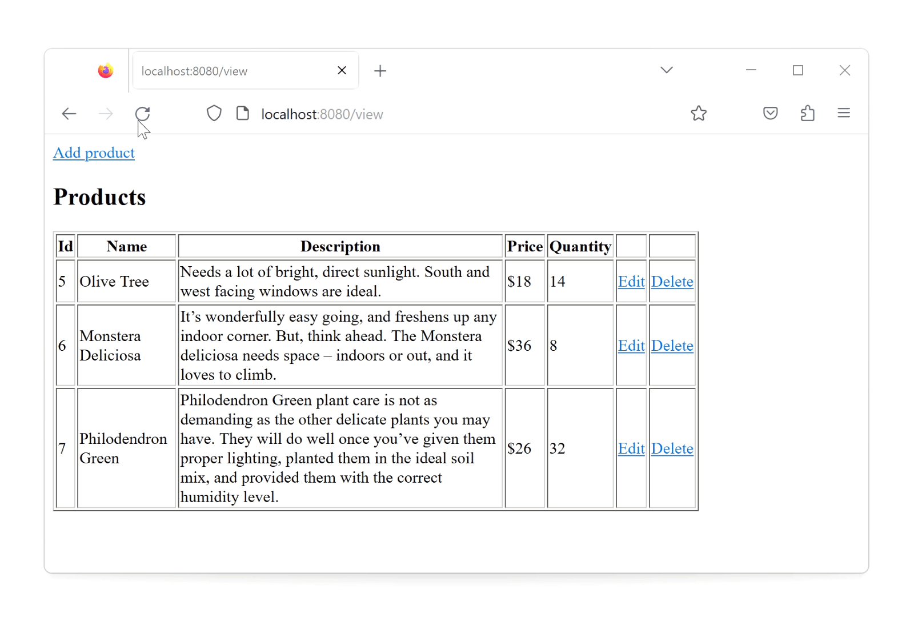

### Module 3.1: Basic Web Application

This is a simple CRUD web applications that allows users to create, read, update and delete data from a database. 

Imagine a plant store that needs to keep track of their products.

It's a primitive study project that uses servlets. The application is built using the MVC pattern and uses the DAO pattern to interact with the MySQL database.

This repo also contains different examples of servlets for study purposes.

#### Create

#### Update

#### Delete
